[github](https://github.com/webobscure) &nbsp;&middot;&nbsp;
[linkedin](https://www.linkedin.com/in/alex-ginovyan-0714a4247/)

> Frontend-leaning full-stack developer in Berlin. 
> I turn practical product ideas into focused, maintainable software.

Right now I am building [Curekey](https://github.com/webobscure/curekey), a local-first desktop 
dictation app for macOS and Windows. Audio and transcription stay on-device.

<samp>typescript &nbsp; javascript &nbsp; react &nbsp; node.js &nbsp; electron &nbsp; laravel &nbsp; graphql &nbsp; postgres &nbsp; redis &nbsp; docker</samp>

**[curekey](https://github.com/webobscure/curekey)** &nbsp;&middot;&nbsp; <samp>typescript, electron, native helpers</samp> 
Local-first desktop dictation with on-device speech recognition, global 
shortcuts, direct text insertion and signed update flows for macOS and Windows.

**[stockdivs](https://github.com/webobscure/StockDivs)** &nbsp;&middot;&nbsp; <samp>laravel, react, postgres, redis</samp> 
Portfolio and dividend tracking with watchlists, alerts, currency conversion, 
replaceable market-data providers and deterministic offline tests.

**[movie collections](https://github.com/webobscure/WMWU)** &nbsp;&middot;&nbsp; <samp>react, typescript, graphql, prisma</samp> 
A full-stack movie discovery and collection app backed by Apollo Server, 
PostgreSQL and TMDB, with personal ratings, notes and watch progress.

